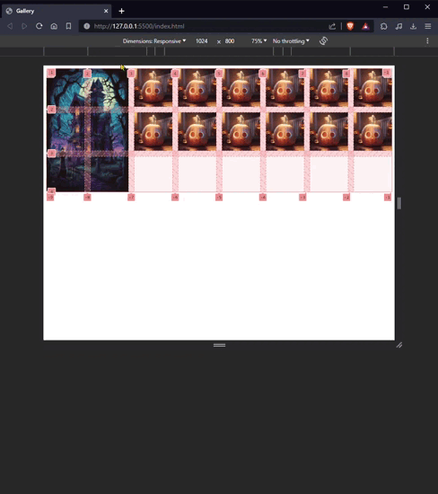

# GALERÍA HALLOWEEN


Galería responsive, utilizando `grid`.

```css
.gallery {
  display: grid;
  grid-template-columns: repeat(auto-fit, minmax(100px, 1fr));
  grid-auto-flow: dense;
  gap: 1em;
}
.house-img {
  grid-column: 1/3;
  grid-row: 1/4;
}
```
## `auto-fit`
+ La cuadrícula se adapta automáticamente al ancho del contenedor y ajusta el número de columnas en función del espacio disponible.
+ Si el espacio disponible es mayor que el necesario para llenar todas las columnas con elementos, las columnas vacías colapsarán; es decir, ***no ocuparán espacio***.
+ Esto significa que si tienes **menos elementos** de los necesarios para **llenar todas las columnas**, las **columnas vacías se reducirán al mínimo posible**, y el **espacio sobrante** se **distribuirá** de **manera equitativa** entre columnas llenas.
## `auto-fill`
+ La cuadrícula también se adapta automáticamente al ancho del contenedor y ajusta el número de columnas en función del espacio disponible.
+ Sin embargo, a diferencia de `auto-fit`; las columnas vacías creadas por `auto-fill` ocuparán espacio en el contenedor, incluso si no hay elementos para llenarlas.
+ Esto significa que con `auto-fill`, las **columnas siempre ocuparán espacio**, y si **tienes menos elementos que columnas**, el **espacio adicional** se **mantendrá en blanco**.
### Resumen
+ `auto-fit` y `auto-fill` gestionan las columnas vacías en una cuadrícula CSS cuando exíte espacio adicional.
+ `auto-fit` colapsa las columnas vacías y distribuye el espacio extra entre las columnas llenas.
+ `auto-fill` mantiene las columnas vacías y las hace ocupar espacio en el contenedor.

## `grid-auto-flow: dense`
+ Intentará rellenar el espacio disponible de la cuadrícula con elementos que vienen después en el orden del flujo normal de los elementos.
+ Esto significa que si tienes elementos que podrían encajar en un espacio vacío, pero están más adelante en la secuencia de elementos HTML, la cuadrícula reorganizará los elementos para llenar esos espacios en lugar de dejarlos vacíos.